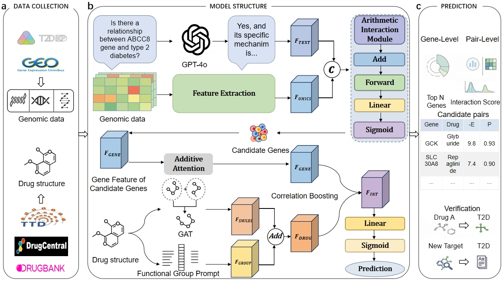

# TADE: A Knowledge-Guided and Data-Refined Framework for Druggable Gene Discovery and Drug Repurposing in Type 2 Diabetes

[](https://codeocean.com/capsule/3776997/tree)
[](https://opensource.org/licenses/MIT)

TADE is a unified deep learning framework designed to solve two sequential tasks in therapeutic discovery for Type 2 Diabetes (T2D): **the discovery of druggable genes** and **the prediction of gene–drug interactions (GDI)** for drug repurposing. 

By operationalizing a "knowledge-guided and data-refined" paradigm, TADE integrates mechanistic knowledge synthesized by Large Language Models (LLMs) as semantic priors with multi-omics data (GWAS, DNA methylation, transcriptomics) as quantitative corrections.

---

## 🎨 Framework Architecture


*Figure: The TADE architecture integrates LLM-derived knowledge and multi-omics signals to prioritize druggable genes and repurposable drugs.*

---

## 🚀 Reproducibility (Highly Recommended)

To ensure immediate reproducibility of the core results, performance metrics, and figures (Fig. 2 and Fig. 3) reported in our manuscript, we provide an executable **Code Ocean** capsule. This environment is pre-configured with all necessary dependencies and pre-trained weights.

**[Run on Code Ocean](https://codeocean.com/capsule/3776997/tree)**

---

## 🛠️ Environment Setup

If you prefer to run the analysis locally, we recommend using a Linux environment (Ubuntu 22.04) with Python 3.10 and CUDA 11.8.

### 1. Requirements
- PyTorch == 2.1.0
- DGL == 2.1.0 (with CUDA 11.8 support)
- RDKit == 2023.9.5
- dgllife == 0.3.2

### 2. Installation
We recommend using `conda` or `mamba` to manage dependencies:

```bash
# Core Graph and ML dependencies
pip install dgl==2.1.0+cu118 -f https://data.dgl.ai/wheels/cu118/repo.html
pip install torchdata==0.7.1
pip install dgllife==0.3.2
pip install rdkit==2023.9.5

# Numerical and Analysis tools
pip install einops==0.8.2 \
            shap==0.46.0 \
            adjustText==1.3.0 \
            pandas==2.2.2 \
            numpy==1.26.4 \
            matplotlib==3.8.4 \
            seaborn==0.13.2 \
            scikit-learn==1.3.2 \
            joblib==1.4.2 \
            scipy==1.12.0 \
            Pillow==10.3.0 \
            tqdm pydantic
```

---

## 📂 Project Structure

- `code/`: Contains the core implementation and pipelines.
    - `models/`: Architecture definitions for TADE-Gene and TADE-GDI.
    - `train_val_test_draw/`: Jupyter Notebooks for cross-validation, external testing, and figure generation.
- `datasets/`: Processed feature datasets for T2D (available via Code Ocean).
- `save/`: Pre-trained model weights and scalers for reproduction(available via Code Ocean).

---

## 📊 Usage

The analysis is organized into two main workflows:

1. **Druggable Gene Prediction**: Refer to `druggable_gene.ipynb` for the evaluation of T2D target prioritization across DrugBank, GeneCards, and MalaCards datasets.
2. **Gene-Drug Interaction (GDI)**: Refer to `gene_drug_interaction.ipynb` for predicting potential repurposable drugs for prioritized T2D targets.
3. **Advanced Interpretability**: Refer to `ablation.ipynb` for operational boundary delineation.

---
