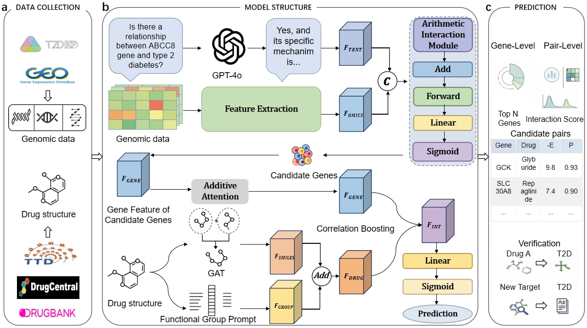

# Computational Knowledge-Omics Integration Reveals Druggable Genes and Therapies in Type 2 Diabetes

[](https://opensource.org/licenses/MIT)

TADE is a unified deep learning framework for two sequential tasks in therapeutic discovery for type 2 diabetes (T2D): **druggable gene discovery** and **gene-drug interaction prediction** for drug repurposing.

TADE integrates LLM-derived mechanistic descriptions with multi-omics features, including GWAS, DNA methylation, and transcriptomic signals.

---

## Framework Architecture



---

## Reproducibility

An executable Code Ocean capsule is available here:

[Run on Code Ocean](https://codeocean.com/capsule/3776997/tree)

The processed data package is available here:

[Google Drive: TADE external data package](https://drive.google.com/drive/folders/1b5JZqKa24pdeKKWG4F5L3uU3QlblFweU?usp=drive_link)

After downloading and unzipping the data package, prepare the local repository layout with:

```bash
python prepare_external_data.py /path/to/TADE_external_data_package
```

This creates links from the external data package into the paths expected by the notebooks and scripts. Use `--copy` instead if symlinks are not available:

```bash
python prepare_external_data.py /path/to/TADE_external_data_package --copy
```

---

## Environment Setup

We recommend a Linux environment with Python 3.10 and CUDA 11.8.

Core dependencies:

- PyTorch == 2.1.0
- DGL == 2.1.0
- RDKit == 2023.9.5
- dgllife == 0.3.2

Install the main dependencies:

```bash
pip install dgl==2.1.0+cu118 -f https://data.dgl.ai/wheels/cu118/repo.html
pip install torchdata==0.7.1
pip install dgllife==0.3.2
pip install rdkit==2023.9.5
pip install einops==0.8.2 shap==0.46.0 adjustText==1.3.0 \
            pandas==2.2.2 numpy==1.26.4 matplotlib==3.8.4 \
            seaborn==0.13.2 scikit-learn==1.3.2 joblib==1.4.2 \
            scipy==1.12.0 Pillow==10.3.0 tqdm pydantic
```

---

## Project Structure

- `code/`: core implementation and analysis pipelines.
  - `train_val_test_draw/`: notebooks for model evaluation and figure generation.
  - `train_val_test_draw/models/`: TADE-Gene and TADE-GDI model definitions.
- `audit/`: supplementary scripts and lightweight output tables.
- `prepare_external_data.py`: helper script for linking the external data package into the repository layout.

---

## Usage

The main analysis workflows are:

1. `code/train_val_test_draw/druggable_gene.ipynb`
2. `code/train_val_test_draw/gene_drug_interaction.ipynb`
3. `code/train_val_test_draw/ablation.ipynb`
